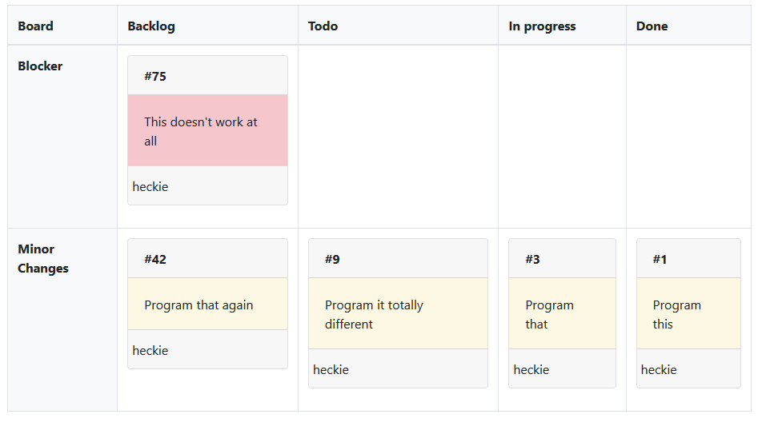

# Rule-based table for agile

This project provides a flexible agile table written in JavaScript. I programmed it initially in 2012 in order to manage my project which was about development and running a multi-brand shop platform. The advantage was to manage our daily business with more than 100 feature requests and incidents of different priority per month. I used the issue tracking system [trac](https://trac.edgewall.org/). In this time I added several improvements to this software. This agile table is one of these improvements. 

An easy peasy example can be seen [here](http://heckie.de/kanban/example_01/index.html)

## 1. General idea

A kanban board is basicly a table. The _columns_ represent the steps of your process. In many cases you start with steps like 'todo', 'work in progress' and 'done'. Of course, this is a naiv example. According kanban the _rows_ represent different service classes so that you are able to handle tasks with different priority and limit the work in progress in terms of task's effort. 

In the following example we see the process steps 'todo', 'work in progress' and 'done'. The service classes are 'incidents', which must probably handled with higher priority, 'change requests' und 'improvements'. Maybe 'improvements' are just little tasks in comparison to 'change requests'. _Tasks_ are represented by tickets that are sticked in cells of the table according their nature and status.


In this example a task must be of type 'change request' in order to fulfil the rules of the row 'change requests'. To be allowed to stick the ticket in the column 'work in progress' the ticket must be in this state. In the end the right cell is the cell in which the ticket fulfills all rules that are defined in the headers of columns and rows. 

## 2. Technical idea

I wanted to provide a Kanban board that is as flexible as possible. Since Kanban is about continuously improvements (Kaizen) something hard-coded wouldn't be good enough. Based on my professional background - I started my career as a software developer, consultant and trainer for a rule engine - I programmed something that is based on rules and a table. 

From a technical point of view the kanban board is based on
1. an _HTML table_ which represent the kanban board
2. _JavaScript snippets_ that represent rules 
3. and more _JavaScript_ that renders the ticket

## 3. Creating an agile table

First of all you create a HTML table. There is special attribute called ```data-kb-rules``` that is used in order to tell the rule engine which rules must be fulfilled. This attribute is normally used in cells of type header, i.e. ```<th>```.  

**Example 1 - ```board.html```**
```html
  <table class="table table-bordered">
    <thead class="bg-light">
      <tr>
        <th>Board</th>
        <th data-kb-rules="!todo,!wip,!done">Backlog</th> <!-- three rules combined and negated by using exclamation mark -->
        <th data-kb-rules="todo">Todo</th> <!-- rule called 'todo' is used in this column -->
        <th data-kb-rules="wip">In progress</th> <!-- rule called 'wip' is used in this column -->
        <th data-kb-rules="done" data-kb-template="small">Done</th> <!-- rule called 'done' is used in this column -->
      </tr>
    </thead>
    <tbody>
      <tr>
        <th class="bg-light" data-kb-rules="blocker">Blocker</th> <!-- rule called 'blocker' is used in this row -->
        <td></td>
        <td></td>
        <td></td>
        <td></td>
      </tr>
      <tr>
        <th class="bg-light">Minor Changes</th> <!-- no additional rule used here! -->
        <td></td>
        <td></td>
        <td></td>
        <td></td>
      </tr>
    </tbody>
  </table>
```

As you can see this tables uses rules that are called ```todo```, ```wip``` and ```done``` in order to define the columns of the table. Rules can be combined by separating them with comma. Rules can be negated by using an exclamation mark. Another rule called ```blocker``` is used in order to define the rule of the first row. The second row does not seem to have a specific rule. 

_But where are the rules?_

## 4. Defining the rules 

The rules are defined by using a JavaScript object like this:

**Example 1 - ```rules.js```**
```javascript
var rules = {
  "todo" : {
      "match" : function(ticket) {
          return ticket["status"] === "todo";
      },
      "last" : false,
      "style" : ''
  },
  "wip" : {
      "match" : function(ticket) {
          return ticket["status"] === "wip";
      },
      "last" : false,
      "style" : ''
  },
  "done" : {
      "match" : function(ticket) {
          return ticket["status"] === "done";
      },
      "last" : false,
      "style" : ''
  },
  "blocker" : {
      "match" : function(ticket) {
          return ticket["priority"] === "blocker";
      },
      "last" : false,
      "style" : 'table-danger'
  }
};
```

Each rule has at least
* a _name_, i.e. 'wip' 
* a function called _match_ which takes an object, which represents the ticket that must be evaluated, and returns a boolean value

Optionally the rule has
* a property called _last_ which tells the rule engine if other rules (of this column / row) are evaluated after evaluation of current rule.
* a property called _style_ which tells the rule engine to add css styles when it renders the ticket

Now, how is the ticket rendered? 


## 5. Designing the tickets

In order to render a ticket the rule engine calls JavaScript functions that are defined to be _templates_. A template is a function of a JavaScript object like this:

**Example 1 - ```rules.js```**
```javascript
var templates = {
  "wide" : function(ticket, styles) {
    
    var s = '';
    s += '<div class="card mb-3">';
    s += '  <div class="card-header">';
    s += '    <div class="my-0 font-weight-bold">${id}</div>';
    s += '  </div>';
    s += '  <div class="card-body ${style}">${summary}</div>';
    s += '  <div class="card-footer">';
    s += '    <div class="row">';
    s += '      <span class="">${assignee}</span>';
    s += '    </div>';
    s += '  </div>';
    s += '</div>';

    s = templates._fill(s, { "style" : styles === undefined || styles == "" ? "mark" : styles});
    return templates._fill(s, ticket);
  },
  "small" : function(ticket, styles) {
    var s = '';
    s += '<div title="' + ticket["summary"] + '" kb-ticket-id=\"#'
        + ticket["id"] + '\" style=\"background-color: #ffaa00; ' + styles
        + '\">';
    s += '<span>#' + ticket["id"] + '</span>';
    s += '</div>';
    return s;
  },
  "_fill" : function(template, ticket) {
    for ( var p in ticket) {
      if (ticket.hasOwnProperty(p)) {
        var reg = new RegExp("\\$\\{" + p + "\\}", "g")
        template = template.replace(reg, ticket[p]);
      }
    }
    return template;
  }
};
```
In this example there are two templates/functions called 'wide' and 'small'. The function receives an object, which is the ticket that must be rendered, and in addition a string with extra styles. These styles are the ones that have been defined by the rules property ```style```.

Now, let's put all together.

## 6. Integration in HTML

The kanban board must be integrated in your html code. The following steps are required:

1. load ```kanban.js``` : This is the rule engine and API.
2. load your rules as defined in step _4. Defining the rules_
3. load your template as defined in step _5. Designing the tickets_
4. define the container (```<div>```-element or other) in which the kanban board will be placed, e.g. ```<div id="board"></div>```
5. Initiate _kanban_-object, set default template, load ```board.html``` and ticket data

See HTML file of example 1:

**Example 1 - ```index.html```**
```html
<!DOCTYPE html>
<html lang="en">
<head>
<title>jKanban - Example 1</title>
<meta charset="utf-8">
<meta name="viewport" content="width=device-width, initial-scale=1">
<link rel="stylesheet"
  href="http://maxcdn.bootstrapcdn.com/bootstrap/4.0.0/css/bootstrap.css">
<script
  src="http://ajax.googleapis.com/ajax/libs/jquery/3.3.1/jquery.min.js"></script>
<script
  src="http://maxcdn.bootstrapcdn.com/bootstrap/4.0.0/js/bootstrap.min.js"></script>

<!-- kanban lib -->
<script src="../js/kanban.js"></script>

<!-- initializes var rules -->
<script src="kanban/rules.js"></script>

<!-- initializes var templates -->
<script src="kanban/templates.js"></script>

<script type="text/javascript">
  $(document).ready(function() {

    var kanban = new Kanban();
    kanban.setDefaultTemplate('wide');
    kanban.load('kanban/board.html', rules, null);

    $.getJSON("../data/tickets.json", function(tickets) {
      tickets = kanban.populate(tickets, true);
      kanban.renderboard('div#board', templates);
    });

  });
</script>
</head>
<body>
  <div class="container">
    <h1>jKanban - Example 1</h1>
    <div id="board"></div>
  </div>
</body>
</html>
```

## 7. Take a look at the example

The example can be found here http://www.heckie.de/kanban/example_01/index.html

It should look like this screenshot:


The code of the example is in sub-folder of [Example 01](./example_01)

The ticket data that is loaded looks like this:
```javascript
[
  {
      "id" : "#1",
      "summary" : "Program this",
      "priority" : "normal",
      "status" : "done",
      "assignee" : "heckie"
  },
  {
      "id" : "#3",
      "summary" : "Program that",
      "priority" : "normal",
      "status" : "wip",
      "assignee" : "heckie"
  },
  {
      "id" : "#9",
      "summary" : "Program it totally different",
      "priority" : "normal",
      "status" : "todo",
      "assignee" : "heckie"
  },
  {
      "id" : "#42",
      "summary" : "Program that again",
      "priority" : "normal",
      "status" : "",
      "assignee" : "heckie"
  },
  {
      "id" : "#75",
      "summary" : "This doesn't work at all",
      "priority" : "blocker",
      "status" : "",
      "assignee" : "heckie"
  }
]
```

## 8. Real world

Of course, this was a trival example. Our process in real world with 5 different clients was much more complex. In order to give an expression I took two screenshots which show how it looked like in TRAC.

Screenshot - Multiclient board


Screenshot - Single client board with backlog (story map)


# Appendix

_Documentation is missing. To be continued..._

## A. HTML Table attributes

_Features are available. Documentation is missing. To be continued..._

* Advanced tables with row and col spans
* Splitting cards
* Drag & drop support
* Playing with call back 

## B. JavaScript rule objects

_Features are available. Documentation is missing. To be continued..._

* Transistions

## C. JavaScript API

_Features are available. Documentation is missing. To be continued..._

* Other function and debugging